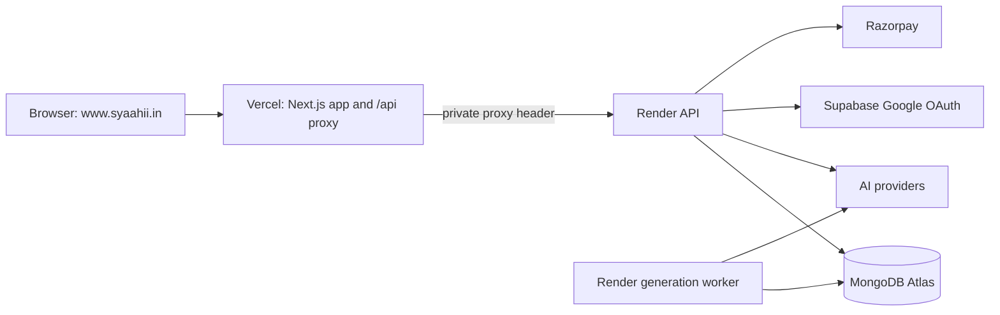

# Syaahi production deployment

## Production architecture

Vercel serves the Next.js frontend and its middleware. The middleware forwards same-origin `/api/*` requests to Render. Render runs the API and the separate generation worker. MongoDB Atlas stores accounts, lessons, jobs, wallets and payment records. Supabase supplies Google identity; Razorpay handles gateway checkout. Vercel is capable of running serverless API functions, but this app's production API/worker architecture is configured on Render.

The app requires MongoDB transactions on a replica-set Atlas deployment. Do not put Atlas, AI or Razorpay secrets in Vercel frontend settings or `NEXT_PUBLIC_*` variables.

## 1. MongoDB Atlas

1. Keep the existing cluster and database so existing users, lessons, wallets and admin roles remain available.
2. Keep a restricted database user with read/write access to the Syaahi database. The database name must match Render's `MONGODB_DATABASE`.
3. Retain the Render network access configuration. Avoid permanent unrestricted access unless a temporary, time-boxed troubleshooting step requires it.
4. Keep backups and test restore separately. Atlas must support transactions.

## 2. Render API and worker

Keep the existing Render API and worker services. They deploy from the same GitHub `main` branch and use the `Dockerfile`/`render.yaml` configuration. The API uses `APP_ROLE=backend`, `DATA_BACKEND=mongo`, `WORKER_MODE=external`; the worker uses `APP_ROLE=worker`, `DATA_BACKEND=mongo`, `WORKER_MODE=embedded`.

Set or confirm these in the Render private environment group:

- `MONGODB_URI`, `MONGODB_DATABASE=syaahi`
- `BACKEND_PROXY_SECRET` — must exactly match Vercel's private value
- `NEXT_PUBLIC_APP_URL=https://www.syaahii.in` after the domain points to Vercel
- `SUPABASE_URL=https://eoybbxevqenijbglhsog.supabase.co`
- `SUPABASE_PUBLISHABLE_KEY` — the project's anon/publishable key
- AI provider keys needed by API/worker
- `RESEND_API_KEY` and `EMAIL_FROM` for password-account verification email
- Razorpay key ID, key secret and webhook secret on the API only

The Render API health check is `/api/health`. Direct protected API requests should be rejected; the Vercel proxy attaches the private header. Deploy the API and worker after pushing code. A missing worker can leave generation queued even when the frontend and health check respond.

## 3. Vercel frontend

Import `mrabhaygod12-alt/syaahi`, production branch `main`, repository root. Select the Next.js framework preset, Node `24.x`, `npm ci` installation and `npm run build`. Leave the Output Directory override disabled. The code selects `.next` on Vercel, which is the Next.js output Vercel expects. Render keeps its separate `.next-production` output. Do not configure a static export.

Set environment variables:

| Variable | Scope | Value |
| --- | --- | --- |
| `APP_ROLE` | Production and Preview | `frontend` (Preview fails closed if backend credentials are absent) |
| `BACKEND_URL` | Production only | Existing Render API HTTPS origin, without `/api` |
| `BACKEND_PROXY_SECRET` | Production only | Same private value as Render |
| `NEXT_PUBLIC_APP_URL` | Production | `https://www.syaahii.in` |

Do not expose provider credentials, Atlas URI or proxy secret to browser code. Avoid giving production backend secrets to untrusted Preview deployments. The app remains on its current frontend host until DNS is changed; a Vercel deployment URL can be smoke-tested first.

## 4. GoDaddy domain and Vercel DNS

1. In Vercel **Project → Settings → Domains**, add `syaahii.in` and `www.syaahii.in`.
2. Vercel will show the DNS records required for this project. In GoDaddy, edit the active DNS records to match those exact targets. Remove stale website A/CNAME values from the previous host; preserve mail and verification TXT/MX records.
3. Keep the current nameservers unless you intentionally move DNS hosting. If GoDaddy is no longer authoritative, edit records at the provider named by the active nameservers.
4. Set `www.syaahii.in` as primary in Vercel. The current screenshot connects both domains to Production with no redirect selected; optionally configure the apex as a permanent redirect to `www` for one canonical origin. Verify DNS and HTTPS before testing login or payments.
5. Do not delete GoDaddy registration. The domain stays registered there even while Vercel serves the app.

## 5. Supabase and Google OAuth

The correct Supabase project is `eoybbxevqenijbglhsog`; its Auth settings endpoint responded successfully and Google was enabled during the setup check. The Supabase **OAuth Server** consent page is separate from Google sign-in configuration.

After `https://www.syaahii.in` resolves to Vercel with HTTPS:

- Supabase Authentication → URL Configuration: Site URL `https://www.syaahii.in`.
- Allow redirect URL `https://www.syaahii.in/api/auth/callback`. The apex may redirect to www; keep its callback only if you explicitly need it. Remove obsolete frontend callback origins.
- Supabase Authentication → Sign In / Providers → Google: keep the existing Google web client ID/secret configured.
- Google OAuth authorized JavaScript origin: `https://www.syaahii.in` (add the apex only if it is used directly). Remove obsolete frontend origins.
- Google's authorized redirect URI remains the Supabase callback: `https://eoybbxevqenijbglhsog.supabase.co/auth/v1/callback`.

Test a new Google signup and an existing account from the final custom domain. Application accounts, passwords, sessions and balances stay in Atlas. New signup allowance is 19 credits; existing balances are not reduced.

## 6. Razorpay and UPI

Razorpay order creation, capture verification and signed webhooks run through the Vercel `/api` proxy to Render. Update the Razorpay webhook target to `https://www.syaahii.in/api/razorpay/webhook` and verify the webhook secret matches Render. Use test mode first; a Git push does not update the Razorpay dashboard. Direct UPI QR/UTR review remains a separate, operator-approved flow.

Test on the custom domain: successful checkout, cancellation, invalid signature rejection, duplicate webhook idempotency, manual UTR review and account-specific wallet history. Only change to live keys after merchant activation and successful test reconciliation.

## 7. Cutover checks

- Latest `main` commit deployed successfully to Vercel; `/api/health` works through the Vercel proxy.
- Render API and worker are healthy and connected to the existing Atlas database.
- Vercel has production `APP_ROLE`, `BACKEND_URL`, `BACKEND_PROXY_SECRET` and canonical app URL.
- Custom domain DNS and HTTPS are active.
- Google login and password verification callback return on `www.syaahii.in`.
- Lesson generation completes through the Render worker; PDF export works.
- Razorpay webhook and payment history update the correct user's wallet once.

Keep the old deployment out of service after cutover, but do not delete the Vercel project or Atlas data during debugging. Provider dashboards must be configured by their account owner; pushing code does not change them.

## References

- [Vercel Next.js deployment](https://vercel.com/docs/frameworks/nextjs)
- [Vercel domains](https://vercel.com/docs/domains/working-with-domains/add-a-domain)
- [Render deploys](https://render.com/docs/deploys)
- [MongoDB Node driver transactions](https://www.mongodb.com/docs/drivers/node/current/crud/transactions/)
- [Supabase Google login](https://supabase.com/docs/guides/auth/social-login/auth-google)
- [Supabase redirects](https://supabase.com/docs/guides/auth/redirect-urls)
- [Razorpay Standard Checkout](https://razorpay.com/docs/payments/payment-gateway/web-integration/standard/integration-steps/)
