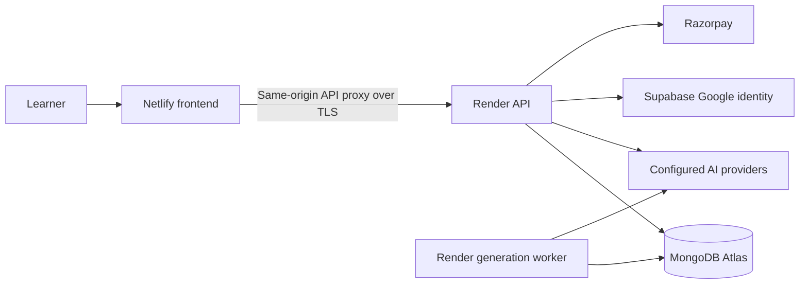

# Deploy Syaahi: Netlify + Render + Atlas

## New signup and verified-referral release

New email/Google accounts receive **21 study credits once**. Existing balances are preserved. Every eligible verified signup awards **5 reward credits to the inviter**, with at most 20 monthly qualifications. The reward wallet converts one-for-one into study credits; three credits are one token. Payment capture no longer triggers a new referral reward. Previously rewarded referrals cannot qualify again.

For email verification set `RESEND_API_KEY` and `EMAIL_FROM` on Render, using a verified sender domain. `NEXT_PUBLIC_APP_URL` must be the HTTPS frontend URL. Learners request a verification email from the dashboard/referral wallet; links expire in one hour. Delivery is not active without these settings. Google verification uses the confirmed OAuth identity; referral codes survive the OAuth redirect. Deploy both frontend and backend for these changes to appear on the public site.

MongoDB transactions are required. Registration now fails atomically when a transaction cannot commit, rather than attempting partial fallback writes. Atlas supports transactions; investigate connection, database permissions and replica-set configuration instead of bypassing atomicity.

APInex and Zen catalog/routing setup and unresolved live-access checks are in [PROVIDERS.md](docs/PROVIDERS.md).

## Update: consent, support and Gemini audio — 24 September

Set `SUPPORT_ADMIN_IDS` privately on Render to trusted account UUIDs, separated by commas. Create the operator account normally; its authenticated `/api/auth` response contains `user.id`. Operators use `/support` to see the staff inbox. Learners see only their own tickets. Messages persist in the configured database; email notifications are not enabled.

Password login, signup and Google initiation require `acceptTerms: true` and `termsVersion: 2026-09-24`. The interface supplies these after the unchecked consent box is selected. The accepted version/time is saved. Google callbacks also require a short-lived consent cookie.

Gemini supplies both transcription and TTS. Transcription defaults to `gemini-3.8-flash`; speech uses `gemini-3.1-flash-tts-preview`. Audio uploads are limited to 8 MB. A transient 502/503 receives one bounded retry. See [Google audio documentation](https://ai.google.dev/gemini-api/docs/audio).

### Credentials needed

- **Supabase:** project URL and publishable/anon key. No service-role secret is needed. Enter Google OAuth client ID/secret in Supabase and allow the frontend callback URL.
- **Atlas:** connection URI with a dedicated database user, database name and Render network allowlist. No Atlas organisation admin key is required.
- **AI:** eligible server keys; Gemini is required for speech and screenshots.
- **Razorpay:** key ID, key secret and separate webhook secret, initially in test mode.
- **Netlify/Render:** connect the GitHub repository in their dashboards. Set the shared backend proxy secret privately in both platforms. Provider account passwords do not need to be shared.
- **Operations:** support contact and trusted support account UUIDs.

Store secrets in the hosting dashboards, not in chat or Git. Render supplies the HTTP ingress/load balancer. Shared Atlas state and worker leases allow multiple instances, but actual sizing and provider capacity still require load tests.

Updated 22 September 2026. These are configuration instructions, not a record of a completed cloud deployment. The included Render blueprint uses paid starter instances; inspect the current provider prices before creating services.

## Architecture



Application cookies stay on the frontend domain. Middleware adds a private proxy header when forwarding `/api` to Render; direct backend API calls are rejected except the health probe. Never expose `BACKEND_PROXY_SECRET` through a `NEXT_PUBLIC_` variable. Heavy PDF work runs on Render. Generation runs in the dedicated worker. Native recording and uploads still depend on the browser and hosting request limits.

## 1. MongoDB Atlas

1. Create a project and an Atlas cluster in an appropriate region. Use a replica-set deployment supporting transactions. Choose capacity after measuring your workload.
2. Create a dedicated database user with read/write permission only for the `syaahi` database. Use a generated password and store it as a secret.
3. In Network Access, allow the outbound IP ranges shown for your Render services. Avoid a permanent unrestricted `0.0.0.0/0` rule. Private networking is an option on suitable plans.
4. Copy the Drivers connection string, URL-encode special password characters, and set it as `MONGODB_URI` in Render. Set `MONGODB_DATABASE=syaahi` and `DATA_BACKEND=mongo`.
5. Enable suitable backups and test a restore to a separate database. Indexes are created by the application at startup; the application user needs index creation permission.

The implementation stores users, sessions, jobs, wallets, ledger events, reservations, orders, referral records, study state and sharing permissions in Atlas. Do not create a second application database in Supabase unless there is a separate requirement.

### Existing local data

Stop the old API and workers, copy the SQLite database and its WAL safely, then run a dry run:

```sh
npx tsx scripts/migrate-to-mongo.ts
```

With `MONGODB_URI` set to an **empty target database**, inspect the counts and run:

```sh
npx tsx scripts/migrate-to-mongo.ts --apply --source-stopped
```

The migration refuses nonempty destination collections and uses one transaction. It is intended for this small initial database, not an online large-dataset migration. Keep the source backup. Never run old and new writers simultaneously. Legacy JSON lesson imports are separate and require explicit account assignment using `scripts/import-legacy.ts`.

## 2. Render API and worker

Create an environment group named `syaahi-private` with:

| Variable | Purpose |
|---|---|
| `MONGODB_URI`, `MONGODB_DATABASE` | Shared application database |
| `NEXT_PUBLIC_APP_URL` | Exact frontend origin, no trailing slash |
| `BACKEND_PROXY_SECRET` | A random secret of at least 32 bytes, also set privately on Netlify |
| `GROQ_API_KEY` and/or `GEMINI_API_KEY` | Eligible AI credentials |
| `SUPABASE_URL`, `SUPABASE_PUBLISHABLE_KEY` | Optional Google login |
| `RAZORPAY_KEY_ID`, `RAZORPAY_KEY_SECRET`, `RAZORPAY_WEBHOOK_SECRET` | Optional checkout |
| `SUPPORT_EMAIL` | Real monitored support address |

Generate a proxy secret locally, store it directly in the two provider dashboards, and do not commit it. Import `render.yaml` as a Blueprint. The API uses `APP_ROLE=backend`, `WORKER_MODE=external`; the worker uses `APP_ROLE=worker`, `WORKER_MODE=embedded`. Both use Atlas. The Docker image includes Chromium and local print fonts.

Check `/api/health` on the Render URL; it should return 200 only when MongoDB is reachable. Record the API URL for the next step. Direct `/api/jobs` requests to Render should return 403 because the frontend proxy header is missing.

## 3. Netlify frontend

Connect the GitHub repository. The included `netlify.toml` sets Node 24, the build command, output directory and frontend role. Set:

- `APP_ROLE=frontend`
- `BACKEND_URL=https://your-api.onrender.com`
- `BACKEND_PROXY_SECRET` with the same private value as Render
- `NEXT_PUBLIC_APP_URL=https://your-frontend-domain`

Give runtime middleware access to these private environment variables in Netlify. **Do not add MongoDB, AI or Razorpay secrets to Netlify.** Use the current supported Next.js adapter; Netlify documents its automatic framework integration. If an adapter changes custom dist-directory behaviour, validate build/output settings against that version.

After deployment, test signup/login, cookie persistence, a saved lesson, generation across a worker restart, PDF export, large uploads and audio download. Specifically measure proxy upload/response limits and timeouts: local success does not establish the deployed platform limits. Larger files may require direct signed object uploads in a later scaling step.

## 4. Google login through Supabase

1. Create a Supabase project. Copy its project URL and publishable key into Render secrets.
2. In Google Cloud, create OAuth credentials for your app and consent screen. Supply the Google client ID/secret inside Supabase’s Google provider settings, not in the frontend repository.
3. Set Google’s authorised redirect URI to the callback shown by Supabase, generally `https://PROJECT.supabase.co/auth/v1/callback`.
4. In Supabase URL Configuration, set the Site URL to your frontend origin and allow `https://YOUR-FRONTEND/api/auth/callback`. Add localhost explicitly for development if needed.
5. Test Continue with Google, cancellation, expired callback, logout and duplicate-email behaviour. Syaahi uses PKCE and server-side identity verification before creating its own session. It deliberately rejects automatic merging into an existing password account.

## 5. Razorpay

Configure test-mode merchant keys on Render first. Register a webhook at `https://YOUR-FRONTEND/api/razorpay/webhook`, using a separate webhook secret. Enable the captured-payment event supported by the handler (`payment.captured`). The server owns prices, verifies HMAC signatures, fetches payment status and checks order ownership/amount/currency. Wallet grants are transactional and idempotent.

Test successful capture, duplicate callbacks, failed payment, invalid amount/signature and the first-purchase referral reward. Merchant activation, settlement/KYC, tax/legal details and a real support contact are operator tasks. Bank refunds are an operator-reviewed process; automatic bank-refund tooling is not implemented.

## 6. What Cloudflare does

Cloudflare can manage your domain’s DNS and provide an optional reverse proxy, TLS edge controls, WAF and rate limiting. It does not replace Atlas, Netlify or the Render worker.

1. Add your domain in Cloudflare and review the imported DNS records, especially mail records.
2. Change nameservers at your registrar to the pair Cloudflare supplies.
3. Add your custom domain in Netlify. Create the exact CNAME/A records Netlify instructs; begin with DNS-only records while domain verification and certificates complete.
4. After HTTPS works, consider Cloudflare proxying where compatible with Netlify’s documented setup. Use Full (strict) TLS. Do not use Flexible TLS.
5. Never cache `/api/*`, `/lesson/*`, `/share/*`, account pages, or any response with session cookies. Do not enable Cache Everything across the app.
6. Add measured abuse controls for login, anonymous sharing and uploads. Ensure edge rules allow Razorpay webhook delivery and OAuth callbacks without browser challenges.
7. Verify forwarding headers in the deployed environment. `TRUST_PROXY_HEADERS=true` belongs only on the backend protected by the secret-bearing proxy, which overwrites the forwarded IP. Keep it false for a directly exposed local server.

## 7. Six keys per provider

Use the base variable or numbered slots `_1` through `_6`, for example `GEMINI_API_KEY_1` or `MISTRAL_API_KEY_6`. Text routing tries another credential only for authentication/permission failure, then moves providers for quota/service failures. A 429 cools down the provider family. Numbered keys do not multiply project or organisation quotas. Image/transcription/speech select a configured slot per request; they do not promise unlimited capacity.

## 8. Scaling and release gates

100,000 registered accounts and 100,000 simultaneous AI jobs are very different workloads. This code has transactional reservations, worker leases, database-backed cloud throttling, bounded provider retries and two concurrent PDF contexts per API process. It has not been load-tested for 100,000 users.

Measure API p95 latency, queue age, token throughput, provider 429s, Mongo pool utilisation, PDF memory, error rates and recovery time. Increase worker replicas only within paid/contracted provider capacity. Benchmark on the actual service sizes and set alerts/budgets. Add object storage for large files, durable provider-wide quota coordination, operational dashboards, backups/restore drills and incident procedures before a large public launch.

## Official references

- [Netlify Next.js](https://docs.netlify.com/build/frameworks/framework-setup-guides/nextjs/overview/)
- [Render Blueprint specification](https://render.com/docs/blueprint-spec)
- [MongoDB transactions](https://www.mongodb.com/docs/drivers/node/current/crud/transactions/)
- [Supabase Google login](https://supabase.com/docs/guides/auth/social-login/auth-google)
- [Razorpay web checkout](https://razorpay.com/docs/payments/payment-gateway/web-integration/standard/integration-steps/)
- [Cloudflare domain setup](https://developers.cloudflare.com/fundamentals/manage-domains/add-site/)

### Capacity controls
Set `WORKER_CONCURRENCY=2`, `PAGE_CONCURRENCY=2`, `MAX_ACTIVE_JOBS_PER_USER=3`, and `MONGO_POOL_SIZE=20` initially. Bounds are enforced in code. Each additional worker increases provider demand; add replicas only after measuring queue age, provider rate limits, memory and Atlas connections. Run `npx tsx scripts/test-capacity.ts` for a local smoke check and append `--mongo` for transactional admission checks. These are not production capacity guarantees.

## Manual and automatic UPI payments

See [payment operations and activation](docs/PAYMENTS.md). `/pay` provides direct UPI + bank-reference submission, `/admin/payments` provides restricted bank-receipt approval, and `/pricing` provides Razorpay checkout. Required credentials and live verification remain deployment tasks. Do not advertise an entered UTR as automatic payment confirmation.
