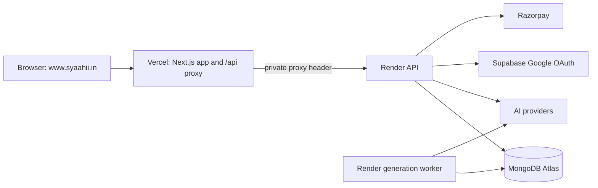

# Syaahi production deployment

## Production architecture

```mermaid
flowchart LR
  U[Browser: www.syaahii.in] --> V[Vercel: Next.js app and /api proxy]
  V -->|private proxy header| R[Render API]
  R --> M[(MongoDB Atlas)]
  W[Render generation worker] --> M
  R --> AI[AI providers]
  W --> AI
  R --> S[Supabase Google OAuth]
  R --> P[Razorpay]
```

Vercel serves the Next.js frontend and its middleware. The middleware forwards same-origin `/api/*` requests to Render. Render runs the API and the separate generation worker. MongoDB Atlas stores accounts, lessons, jobs, wallets and payment records. Supabase supplies Google identity; Razorpay handles gateway checkout. Vercel is capable of running serverless API functions, but this app's production API/worker architecture is configured on Render.

The app requires MongoDB transactions on a replica-set Atlas deployment. Do not put Atlas, AI or Razorpay secrets in Vercel frontend settings or `NEXT_PUBLIC_*` variables.

## 1. MongoDB Atlas

1. Keep the existing cluster and database so existing users, lessons, wallets and admin roles remain available.
2. Keep a restricted database user with read/write access to the Syaahi database. The database name must match Render's `MONGODB_DATABASE`.
3. Retain the Render network access configuration. Avoid permanent unrestricted access unless a temporary, time-boxed troubleshooting step requires it.
4. Keep backups and test restore separately. Atlas must support transactions.

## 2. Render API and worker

Keep the existing Render API and worker services. They deploy from the same GitHub `main` branch and use the `Dockerfile`/`render.yaml` configuration. The API uses `APP_ROLE=backend`, `DATA_BACKEND=mongo`, `WORKER_MODE=external`; the worker uses `APP_ROLE=worker`, `DATA_BACKEND=mongo`, `WORKER_MODE=embedded`.

Set or confirm these in the Render private environment group:

- `MONGODB_URI`, `MONGODB_DATABASE=syaahi`
- `BACKEND_PROXY_SECRET` — must exactly match Vercel's private value
- `NEXT_PUBLIC_APP_URL=https://www.syaahii.in` after the domain points to Vercel
- `SUPABASE_URL=https://eoybbxevqenijbglhsog.supabase.co`
- `SUPABASE_PUBLISHABLE_KEY` — the project's anon/publishable key
- AI provider keys needed by API/worker
- `RESEND_API_KEY` and `EMAIL_FROM` for password-account verification email
- Razorpay key ID, key secret and webhook secret on the API only

Keep exactly one authoritative Supabase project URL. If both `SUPABASE_URL`
and the legacy `SUPABASE_URI` are present, they must identify the same project.
For JWT-form anon keys, startup OAuth configuration rejects a URL/key project
mismatch rather than sending users into a broken Google consent flow. The
publishable/anon key is public by design; never use a service-role key for OAuth.

The Google-login message `Missing: SUPABASE_PUBLISHABLE_KEY` means the running
Render API process did not receive a recognized public Supabase key. Add the
exact variable name `SUPABASE_PUBLISHABLE_KEY` to the **Render API web service**
(not only Vercel, and not only a local `.env` file), alongside
`SUPABASE_URL=https://eoybbxevqenijbglhsog.supabase.co`, then save and redeploy
the API. A valid Supabase anon key is accepted too, but use the current key shown
in Supabase Project Settings → API Keys; never use a `service_role` or secret
key here. Check the Render deploy logs for a successful restart, then test
`/api/auth/google` on the production domain. Do not paste the key into chat,
GitHub, or a `NEXT_PUBLIC_*` variable.

If the key is already visible in Render, confirm the API service is linked to
the environment group containing it, that the service is the one receiving the
Vercel proxy requests, and that you saved and completed a fresh deploy. The
public `/api/health` endpoint checks Mongo status only; it does not prove the
OAuth key is available. The Google button shows a generic error to visitors;
the missing-variable detail is written to Render logs.

Password accounts are not issued an application session until their verification
link is confirmed. Set `RESEND_API_KEY`, a verified `EMAIL_FROM`, and
`NEXT_PUBLIC_APP_URL=https://www.syaahii.in` on Render so signup can send the
one-hour verification link. If delivery fails, signup still creates the account
but protected features remain unavailable; attempting login retries delivery.

The Render API health check is `/api/health`. Direct protected API requests should be rejected; the Vercel proxy attaches the private header. Deploy the API and worker after pushing code. A missing worker can leave generation queued even when the frontend and health check respond.

## 3. Vercel frontend

Import `mrabhaygod12-alt/syaahi`, production branch `main`, repository root. Select the Next.js framework preset, Node `24.x`, `npm ci` installation and `npm run build`. Leave the Output Directory override disabled. The code selects `.next` on Vercel, which is the Next.js output Vercel expects. Render keeps its separate `.next-production` output. Do not configure a static export.

Set environment variables:

| Variable               | Scope                  | Value                                                               |
| ---------------------- | ---------------------- | ------------------------------------------------------------------- |
| `APP_ROLE`             | Production and Preview | `frontend` (Preview fails closed if backend credentials are absent) |
| `BACKEND_URL`          | Production only        | Existing Render API HTTPS origin, without `/api`                    |
| `BACKEND_PROXY_SECRET` | Production only        | Same private value as Render                                        |
| `NEXT_PUBLIC_APP_URL`  | Production             | `https://www.syaahii.in`                                            |

Do not expose provider credentials, Atlas URI or proxy secret to browser code. Avoid giving production backend secrets to untrusted Preview deployments. The app remains on its current frontend host until DNS is changed; a Vercel deployment URL can be smoke-tested first.

## 4. GoDaddy domain and Vercel DNS

1. In Vercel **Project → Settings → Domains**, add `syaahii.in` and `www.syaahii.in`.
2. Vercel will show the DNS records required for this project. In GoDaddy, edit the active DNS records to match those exact targets. Remove stale website A/CNAME values from the previous host; preserve mail and verification TXT/MX records.
3. Keep the current nameservers unless you intentionally move DNS hosting. If GoDaddy is no longer authoritative, edit records at the provider named by the active nameservers.
4. Set `www.syaahii.in` as primary in Vercel and configure the apex as a permanent redirect to `www`. The app also redirects the production apex and exact Vercel alias to the canonical domain. Verify DNS and HTTPS before testing login or payments.
5. Do not delete GoDaddy registration. The domain stays registered there even while Vercel serves the app.

## 5. Supabase and Google OAuth

The correct Supabase project is `eoybbxevqenijbglhsog`; its Auth settings endpoint responded successfully and Google was enabled during the setup check. The Supabase **OAuth Server** consent page is separate from Google sign-in configuration.

After `https://www.syaahii.in` resolves to Vercel with HTTPS:

- Supabase Authentication → URL Configuration: Site URL `https://www.syaahii.in`.
- Allow redirect URL `https://www.syaahii.in/api/auth/callback`. The apex may redirect to www; keep its callback only if you explicitly need it. Remove obsolete frontend callback origins.
- Supabase Authentication → Sign In / Providers → Google: keep the existing Google web client ID/secret configured.
- Google OAuth authorized JavaScript origin: `https://www.syaahii.in` (add the apex only if it is used directly). Remove obsolete frontend origins.
- Google's authorized redirect URI remains the Supabase callback: `https://eoybbxevqenijbglhsog.supabase.co/auth/v1/callback`.

Test a new Google signup and an existing account from the final custom domain. Application accounts, passwords, sessions and balances stay in Atlas. New signup allowance is 19 credits; existing balances are not reduced.

## Search indexing and discovery

- The application emits canonical URLs, a sitemap, robots rules, `WebSite` and
  `Organization` JSON-LD, and `/llms.txt`. The apex and exact production Vercel
  alias permanently redirect to `https://www.syaahii.in`.
- In Google Search Console, add a **Domain** property for `syaahii.in`. Add its
  TXT verification record at the active DNS provider (currently Vercel DNS,
  not GoDaddy), wait for DNS propagation, then verify ownership. Submit
  `https://www.syaahii.in/sitemap.xml` in the Sitemaps report.
- Use URL Inspection on the homepage, `/about`, `/subjects`, and selected
  subject, library, and blog pages. If Google reports the URL is crawlable and
  the canonical is correct, request indexing for important pages. Monitor the
  Page indexing report for crawl blocks, duplicate canonical selection, and
  server errors.
- Search appearance is not guaranteed by metadata, structured data, a sitemap,
  or a code push. For a branded query such as “Syaahi”, keep the product name
  and description consistent on the homepage and About page, and earn
  legitimate references from public profiles and useful original study
  material. Avoid mass-publishing thin pages to chase keywords.

## 6. Razorpay and UPI

Razorpay order creation, capture verification and signed webhooks run through the Vercel `/api` proxy to Render. Update the Razorpay webhook target to `https://www.syaahii.in/api/razorpay/webhook` and verify the webhook secret matches Render. Use test mode first; a Git push does not update the Razorpay dashboard. Direct UPI QR/UTR review remains a separate, operator-approved flow.

### Razorpay setup, test, and go-live

Pricing opens `/checkout/try`, `/checkout/starter`, `/checkout/popular`, or
`/checkout/pro` for plan review. Checkout creates a server-priced order and opens
Razorpay. Its callback submits the signature for verification and sends the
customer to `/payments/<order_id>`. That page reads the authenticated owner's
stored order; URL parameters never mark a purchase as paid. `/payments` shows
the latest 50 Razorpay orders for the signed-in account. Pending orders are
checked up to 12 times, with a manual refresh and support link afterwards.
The signed capture webhook can finish confirmation even after the tab closes.
Direct UPI review continues at `/pay`.

For a test checkout on the production domain, sign in with an account listed in
`PAYMENT_ADMIN_IDS` or the payment-admin database allowlist. Test keys are
intentionally restricted to these accounts in production. These packs are
one-time purchases, not recurring UPI AutoPay mandates or subscriptions.

Run `npm run test:payment-status` for isolated authentication/ownership and
capture-state checks. Run `npm run test:razorpay` after a production build for a
real **test-mode** order and checkout-modal smoke check. The latter does not
submit a payment; finish the captured-payment and webhook test below manually.
If the gateway returns 401, regenerate a matching test key pair and update both
values together on the Render API service. A code push cannot repair revoked
credentials or update service dashboard environment variables.

1. In Razorpay Dashboard, finish the website/app details and payment-method activation. KYC approval alone does not prove that live checkout is enabled.
2. In **Test Mode → API Keys**, generate a test key pair. Add `RAZORPAY_KEY_ID` and `RAZORPAY_KEY_SECRET` to the Render API service only. The browser receives the key ID only after the server creates an order; the secret never goes to Vercel or the client.
3. In **Test Mode → Webhooks**, add `https://www.syaahii.in/api/razorpay/webhook`, create a separate webhook signing secret, and subscribe to `payment.captured`. Put that value in Render as `RAZORPAY_WEBHOOK_SECRET`. It is distinct from the API key secret.
4. Confirm automatic capture is enabled in Razorpay. The app credits only a captured payment that matches its saved order's owner, amount, currency, and payment ID. A signed checkout response is checked on the server, then the payment is fetched from Razorpay; the signed webhook safely recovers a callback interrupted by a closed tab.
5. Test using Razorpay's test checkout credentials. Confirm a successful test payment appears as **Captured** in Razorpay and exactly one matching payment/credit entry appears for the same user in Syaahi. Also test cancel/failure, wrong signature, wrong user/order, repeated verify request, and replayed webhook. Test payments never charge real money.
6. Only after these checks and Razorpay enabling the live account, switch the dashboard to **Live Mode**, generate a new live key pair, replace both Render API key variables, and configure the live webhook with its own secret. Then make one small real purchase and reconcile the captured transaction and settlement in Razorpay before advertising payments as live.

### Country-specific Razorpay prices

The site derives the region from Vercel's `x-vercel-ip-country` request
header. India sees INR, euro-area countries see EUR, and other countries see
USD. Pack prices are fixed by currency: ₹9 / ₹39 / ₹79 / ₹179, $5 / $22 / $44 /
$99, and €5 / €22 / €44 / €99. USD and EUR are separate published prices, not
live FX conversion. UPI remains INR-only.

On the Render **API service only**, `RAZORPAY_SUPPORTED_CURRENCIES` defaults to
`INR`. Keep production at `INR` until Razorpay confirms that the live merchant
can create and capture USD/EUR orders. For testing, use a separate Render
staging service with Test Mode API keys and webhook secret, set
`RAZORPAY_SUPPORTED_CURRENCIES=INR,USD,EUR`, redeploy, and complete a successful
USD/EUR test transaction. If no staging service exists, temporarily replace the
Render API's keys/webhook secret with Test Mode values, run the test as a
payment-admin account, then restore the live values; do not expose live
international orders before approval. The pricing page can display regional
prices before activation, but keeps that currency's purchase button disabled.
The API independently resolves the country and amount; it ignores any currency
or price submitted by a browser. Do not put payment secrets on Vercel.

The API key pair and webhook secret shared in chat should be rotated before production use. If the API secret was ever configured in a client-visible Vercel variable or committed file, revoke it immediately and issue a replacement.

Test on the custom domain: successful checkout, cancellation, invalid signature rejection, duplicate webhook idempotency, manual UTR review and account-specific wallet history. Only change to live keys after merchant activation and successful test reconciliation.

## 7. Cutover checks

- Latest `main` commit deployed successfully to Vercel; `/api/health` works through the Vercel proxy.
- Render API and worker are healthy and connected to the existing Atlas database.
- Vercel has production `APP_ROLE`, `BACKEND_URL`, `BACKEND_PROXY_SECRET` and canonical app URL.
- Custom domain DNS and HTTPS are active.
- Google login and password verification callback return on `www.syaahii.in`.
- Lesson generation completes through the Render worker; PDF export works.
- Razorpay webhook and payment history update the correct user's wallet once.

Keep the old deployment out of service after cutover, but do not delete the Vercel project or Atlas data during debugging. Provider dashboards must be configured by their account owner; pushing code does not change them.

## References

- [Vercel Next.js deployment](https://vercel.com/docs/frameworks/nextjs)
- [Vercel domains](https://vercel.com/docs/domains/working-with-domains/add-a-domain)
- [Render deploys](https://render.com/docs/deploys)
- [MongoDB Node driver transactions](https://www.mongodb.com/docs/drivers/node/current/crud/transactions/)
- [Supabase Google login](https://supabase.com/docs/guides/auth/social-login/auth-google)
- [Supabase redirects](https://supabase.com/docs/guides/auth/redirect-urls)
- [Razorpay Standard Checkout](https://razorpay.com/docs/payments/payment-gateway/web-integration/standard/integration-steps/)
