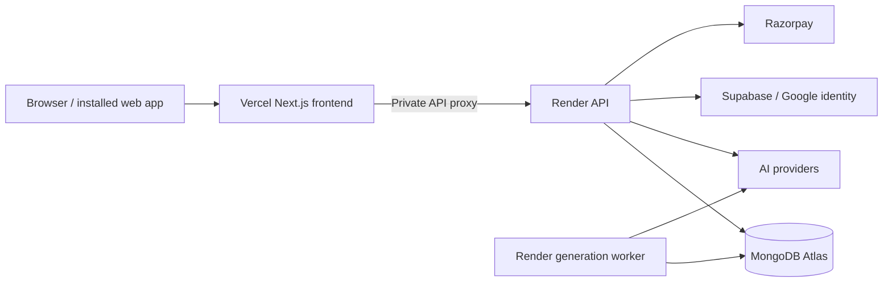

<div align="center">


### Your material. A notebook you can learn from.

**Visual notes · AI study chat · Recall practice · Gemini audio**

[Product](#the-study-workspace) · [Cloud deployment](DEPLOY.md) · [Release status](docs/RELEASE-STATUS.md)

</div>

---

**Syaahi** is an AI-assisted study workspace created by **Chandan Pandey**. Turn a topic, lecture or document into an editable outline, handwritten-style notes, useful diagrams and practice activities. Check the output against your material and return to concepts that need more work.

> **Release stage:** working application preparing for cloud launch. Deployment configuration is included; a public production URL has not been verified. Google sign-in, live payments and hosted infrastructure require operator configuration. See [release status and known limits](docs/RELEASE-STATUS.md).

## The study workspace

| Start with                 | Study with                                   | Keep control                            |
| -------------------------- | -------------------------------------------- | --------------------------------------- |
| A topic or pasted text     | Visual notes with diagrams and formulas      | Review the outline before generating    |
| PDF, DOCX or PPTX          | AI explanations and lesson chat              | Edit notes and export a PDF             |
| A screenshot               | Quizzes and scheduled flashcards             | Organise lessons into folders           |
| YouTube captions           | Saved attempts and weak-area review          | Invite viewers or editors; revoke links |
| Audio uploads or recording | Gemini transcription and downloadable speech | Private accounts and support tickets    |

### Notes designed for the page

Preview and PDF share one renderer. Long explanations continue onto another sheet instead of stretching. Notes support flow, decision, cycle and concept graphics, tables, code and maths. AI output still needs checking against the original material.

### Real Gemini audio

Gemini supplies transcription and generated speech. Choose a voice and delivery style, listen in the workspace or download a WAV file. An eligible Gemini API key is required; provider quotas and availability apply.

## Pricing in the application

**1 token = 3 generated note sections.** A section may continue over multiple PDF sheets without an extra charge. A new account receives 19 credits (6⅓ tokens / 19 note sections).

| Pack    | Tokens | Note sections | Price |
| ------- | -----: | ------------: | ----: |
| Try     |      1 |             3 |    ₹9 |
| Starter |      5 |            15 |   ₹39 |
| Popular |     12 |            36 |   ₹79 |
| Pro     |     30 |            90 |  ₹179 |

Payments use server-owned prices and verified Razorpay captures. Each eligible verified signup gives the inviter 5 reward credits, transferable to their study balance. These are configured product prices, not evidence of revenue or profitability.

## Built for cloud deployment



**Deployment order:** Atlas → Render API and worker → Vercel → Google login and Razorpay → optional Cloudflare → production verification.

1. Connect this repository to Vercel and Render.
2. Set the variables listed in [`.env.example`](.env.example) privately in the hosting dashboards.
3. Follow [DEPLOY.md](DEPLOY.md) for database access, callback URLs, webhooks and Cloudflare setup.
4. Verify login, generation, PDF export, payment capture, recovery, backups and support before opening paid access.

Supabase handles Google identity; Atlas stores application data. Cloudflare is optional. The Render blueprint uses paid starter services. A public deployment and capacity for 100,000 users have not yet been demonstrated.

## Team

| Name                   | Role                         | Background                                                                                                                             |
| ---------------------- | ---------------------------- | -------------------------------------------------------------------------------------------------------------------------------------- |
| **Chandan Pandey**     | Creator                      | Pursuing MSc Digital Forensics and Cyber Security at LPU; four years of web application development and security assessment experience |
| **Manish Kumar Singh** | DevOps Engineer & Researcher | Engineering and research team                                                                                                          |

[Chandan’s portfolio](https://chandanpandeyprot.netlify.app/) · [LinkedIn](https://www.linkedin.com/in/chandan-pandey-5b255a3aa) · [GitHub](https://github.com/thecnical) · [X](https://x.com/CPandey8752)

## Engineering map

| Directory      | Responsibility                                         |
| -------------- | ------------------------------------------------------ |
| `app/`         | Public pages, learning routes and API handlers         |
| `components/`  | Responsive interface and study workspace               |
| `lib/ai/`      | Provider routing, credential slots and bounded retries |
| `lib/jobs/`    | Generation, reservations, worker leases and recovery   |
| `lib/storage/` | MongoDB transactions and cloud persistence             |
| `lib/billing/` | Prices, verified payments and referral accounting      |
| `lib/study/`   | Practice, folders and collaboration permissions        |
| `lib/pdf/`     | Shared notebook preview and PDF renderer               |
| `scripts/`     | Verification, worker startup and data migration        |

The frontend and API share one Next.js codebase and deploy with separate runtime roles. Heavy generation runs in a dedicated worker. SQLite remains available for development; production uses Atlas.

## Security and verification

Controls include hashed passwords, HttpOnly sessions, explicit Terms acceptance, ownership checks, revocable sharing, server-side payment validation, request throttling and private error references. Keys remain server-side. Six credential slots support authorised credentials; they do not multiply quotas.

Read the [NIST CSF assessment](docs/SECURITY-ASSESSMENT.md) for implemented controls and outstanding work. No security certification or guarantee against all attacks is made.

```sh
npm ci
npm run check
npm test
npm run test:study
npx tsx scripts/test-consent-support.ts
npx tsx scripts/test-referrals.ts
npx tsx scripts/test-office.ts
npx tsx scripts/test-proxy.ts
npm run test:mongo
npm run build
```

Requires Node.js 24+. The Mongo test uses a temporary replica set and may download a binary; it does not touch Atlas. Browser and live-provider checks are described in the release status. Live checks consume provider allowance.

<details>
<summary><strong>Contributor setup</strong></summary>

Copy `.env.example` to `.env.local`, configure an eligible provider, run `npx playwright install chromium`, then `npm run dev`. Keep environment files, databases and private exports out of Git. Production setup is covered in [DEPLOY.md](DEPLOY.md).

</details>

## Product documents

- [Research and master plan](docs/MASTER-PLAN.md)
- [Delivered features and remaining gaps](docs/RELEASE-STATUS.md)
- [Deployment and operations](DEPLOY.md)

The roadmap is informed by public study-tool research. Full Turbo parity, native apps, simultaneous character-level collaboration and measured learning gains are not claimed. The next milestone is a monitored learner pilot.

## Payment setup

Direct UPI QR + UTR review and automatic Razorpay capture are separate flows. See [payment setup, QR replacement and verification](docs/PAYMENTS.md). Manual approval and wallet credit are atomic, references cannot be reused, and payment records do not expire from storage. Live merchant configuration and a real receipt check remain required before collecting customer money.

## Custom domain launch

Follow [syaahii.in full-stack launch steps](docs/DOMAIN-LAUNCH.md) for GoDaddy DNS, Vercel frontend, Render API/worker, Atlas, Supabase Google OAuth and Razorpay test checkout.
