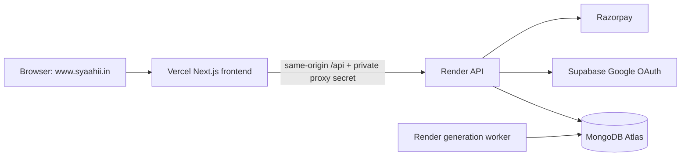

# Syaahii.in domain and full-stack launch guide

## Architecture

GoDaddy remains the registrar. Vercel serves the Next.js app; Render runs protected APIs and the job worker; Atlas holds application records; Supabase handles Google identity. Keep the existing Atlas database and Render services so accounts and balances persist.

## 1. Add domain in Vercel

1. Vercel → Syaahi project → **Settings → Domains**.
2. Add `syaahii.in` and `www.syaahii.in`.
3. Set `www.syaahii.in` as the primary domain. The latest screenshot has both apex and `www` connected directly to Production; configure an apex-to-`www` permanent redirect if you want one canonical host.
4. Vercel displays the DNS targets assigned to this project. Use those exact targets; do not reuse the previous host's IP/CNAME values.

## 2. Update the active DNS records

Check the active nameservers first. The latest screenshots show Vercel nameservers, and GoDaddy says DNS is managed by Vercel; in that state, edit DNS records in Vercel's Domains → DNS Records page. If you later restore GoDaddy's nameservers, edit records at GoDaddy instead.

Replace the old website A/CNAME records with the exact records Vercel showed for `@` and `www`. Preserve mail MX and TXT records (including SPF, DKIM, DMARC and ownership verification). Do not change nameservers just to use Vercel. Wait until Vercel verifies DNS and issues HTTPS.

The GoDaddy WHOIS/contact verification banner is separate from hosting. Complete it in GoDaddy if it is still pending. Do not delete the domain registration.

## 3. Vercel production environment

Import GitHub repository `mrabhaygod12-alt/syaahi`, branch `main`, root directory. Use Next.js preset, Node `24.x`, `npm ci`, and `npm run build`; leave Output Directory override disabled. The app selects `.next` when `VERCEL=1`.

Set:

- `APP_ROLE=frontend` on Production and Preview.
- `BACKEND_URL` to the existing Render API HTTPS origin, without `/api`, on Production.
- `BACKEND_PROXY_SECRET` to the same private value used by Render, on Production only.
- `NEXT_PUBLIC_APP_URL=https://www.syaahii.in` on Production.

Never place Mongo, AI-provider, Razorpay secret or proxy secret in a `NEXT_PUBLIC_*` variable. Keep production credentials out of untrusted Preview deployments.

## 4. Render API and worker

Keep both existing Render services and the same Atlas database. Confirm API role `backend`, `DATA_BACKEND=mongo`, `WORKER_MODE=external`, and worker role `worker`, `DATA_BACKEND=mongo`, `WORKER_MODE=embedded`. Keep the proxy secret identical to Vercel. Once DNS/HTTPS are active, set `NEXT_PUBLIC_APP_URL=https://www.syaahii.in` on Render and redeploy API/worker from the same commit.

API health path: `/api/health`. Test `https://www.syaahii.in/api/health` through Vercel; direct protected Render API paths should reject requests without the proxy secret.

## 5. Supabase Google sign-in

Correct project: `https://eoybbxevqenijbglhsog.supabase.co`. Use the normal **Authentication → URL Configuration** and **Sign In / Providers → Google** pages; the Supabase OAuth Server page is for third-party clients.

After Vercel HTTPS is active:

- Supabase Site URL: `https://www.syaahii.in`.
- Redirect URL: `https://www.syaahii.in/api/auth/callback`.
- Remove callback URLs for the retired frontend host.
- Google Cloud authorized JavaScript origin: `https://www.syaahii.in`; add the apex only if it is used directly, and remove obsolete frontend origins.
- Google authorized redirect URI stays `https://eoybbxevqenijbglhsog.supabase.co/auth/v1/callback`.
- Keep the existing Google client credentials stored in Supabase. Render keeps `SUPABASE_URL` and `SUPABASE_PUBLISHABLE_KEY`; the anon key is not an admin credential.

Test Google login in a fresh browser on `https://www.syaahii.in`; verify the callback returns to the same domain and existing Atlas accounts retain their history and balance.

## 6. Payments and final checks

Set Razorpay webhook to `https://www.syaahii.in/api/razorpay/webhook`; keep its separate signing secret on Render. Test checkout and verify one-time wallet crediting after Vercel domain activation. UPI manual receipt review continues through the existing Atlas-backed admin flow.

Final sequence: domain/HTTPS → Vercel `/api/health` → password and Google login → Atlas user/lesson/wallet continuity → Render worker lesson generation and PDF → Razorpay test webhook and payment history. The same Render/Atlas backend is used across hosting cutover; no data migration should be done just for moving the frontend.
