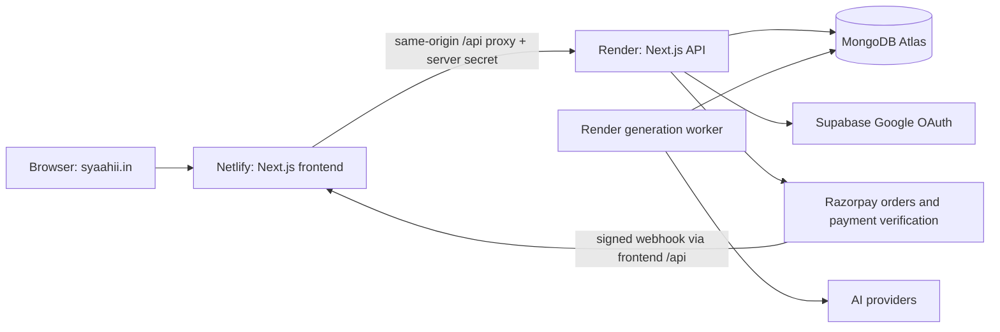

# Syaahii.in: full-stack launch guide

## Architecture and responsibilities

- GoDaddy registers the domain and hosts its DNS records. It does not run this app's backend.
- Netlify serves the frontend and proxies `/api/*` to Render. Browser API calls remain on the same origin; do not point the frontend at Atlas directly.
- Render runs the API and, for `WORKER_MODE=external`, a separate generation worker. Deploy both from the same `main` commit. A web API without its worker will leave generation jobs queued.
- MongoDB Atlas is the source of truth for Syaahi users, hashed passwords, sessions, lessons, wallets, payment records and admin roles.
- Supabase handles Google OAuth. Password accounts and billing remain in Atlas; this is not a migration of the payment database into Supabase. Existing optional password synchronization does not make Supabase the billing authority.
- Razorpay creates orders, accepts checkout payments and sends signed capture notifications. UPI manual review is a separate flow.

## 1. Connect GoDaddy DNS to Netlify

1. Open the existing `syaahii.netlify.app` project, Domain management, Add custom domain: `syaahii.in`. Add/verify `www.syaahii.in` too.
2. In GoDaddy Domain Portfolio, select syaahii.in, DNS, Manage records. Keep GoDaddy nameservers for this route.
3. For Netlify's standard network, use:

| Type  | Host/name | Value               |
| ----- | --------- | ------------------- |
| A     | @         | 75.2.60.5           |
| CNAME | www       | syaahii.netlify.app |

Follow the project-specific Pending DNS verification values if Netlify shows different targets. Edit conflicting parked-site A/CNAME records; preserve existing MX/TXT records for email and ownership verification. Do not add a CNAME at `@`.

4. Set your chosen primary domain in Netlify. This guide uses `https://syaahii.in` consistently; redirect www to it. Netlify recommends www as primary with external DNS for routing performance; choosing www instead is also valid, but substitute that exact origin in every setting below.
5. Wait for DNS verification, then provision the Netlify HTTPS certificate for both names. Confirm the certificate and redirect before changing authentication's canonical URL. DNS propagation can take hours.
6. The earlier `.netlify.app` address is useful during migration; users must sign in again on the new domain because cookies are host-specific.

Cloudflare is optional and is not necessary to launch this setup. Do not simultaneously change nameservers and add another proxy while debugging initial DNS/SSL. Cloudflare DNS/security can be introduced later with deliberate origin and certificate configuration.

## 2. Netlify frontend environment

Use the existing GitHub repository and `main`. Keep the repository's `netlify.toml`/Next.js integration, `npm run build`, and production Next output. Do not configure this app as a static HTML export.

| Variable             | Value                                             |
| -------------------- | ------------------------------------------------- |
| APP_ROLE             | frontend                                          |
| BACKEND_URL          | Your actual Render API HTTPS origin, without /api |
| BACKEND_PROXY_SECRET | Same long private value as Render                 |
| NEXT_PUBLIC_APP_URL  | https://syaahii.in, after DNS/HTTPS works         |

Keep the proxy secret server-only. No Mongo URI, Razorpay secret or service-role key belongs in any `NEXT_PUBLIC_*` value. Trigger a new Netlify deploy when public build-time values change.

## 3. Render API and worker environment

The repository includes `render.yaml` and `Dockerfile`. API health path: `/api/health`. Set API `APP_ROLE=backend`, `DATA_BACKEND=mongo`. Configure:

- `MONGODB_URI`: Atlas connection string containing the restricted database user's credentials.
- `MONGODB_DATABASE`: retain the existing database name to preserve accounts and payment-admin roles.
- `BACKEND_PROXY_SECRET`: exact same value as Netlify.
- `NEXT_PUBLIC_APP_URL=https://syaahii.in` after DNS/HTTPS works.
- API `WORKER_MODE=external` when the generation worker is running. Worker uses `APP_ROLE=worker`, `WORKER_MODE=embedded`, the same Atlas database and the provider keys it needs.
- `SUPABASE_URL`, `SUPABASE_PUBLISHABLE_KEY` (or supported anon key alias) for Google OAuth.
- `RESEND_API_KEY`, `EMAIL_FROM` and verified sending domain for password-account verification emails. Do not expose email verification tokens to the requesting browser.
- `RAZORPAY_KEY_ID`, `RAZORPAY_KEY_SECRET`, `RAZORPAY_WEBHOOK_SECRET` on the API. These need not be supplied to Netlify or the worker.

Local private `.env.render` contains prepared values. Copy through the provider's secure Environment UI; do not commit that file. It does not automatically update Render. Use Manual Deploy > Deploy latest commit when auto-deploy is disabled. Existing services should be updated rather than duplicated.

## 4. Atlas

Keep the existing cluster/database. Allow the Render service's documented outbound IP ranges in Atlas Network Access; restrict the database account to the required database. Use a replica set/Atlas deployment because credit and payment transactions require MongoDB transactions. Enable backups and test recovery. Do not publish database credentials in frontend settings.

The existing payment administrator was provisioned in the configured Atlas database. Changing MONGODB_DATABASE would make it appear missing. `/admin/payments` is authenticated and role restricted. It includes a Razorpay order-history tab alongside manual UPI review. It shows customer name/email/user ID, order, UTR, receiving ID, amount, status and timestamps; search can narrow it to one customer. Approval credits the immutable payment owner, not a user ID submitted by the admin's browser.

## 5. Supabase + Google OAuth

Confirmed project: `https://eoybbxevqenijbglhsog.supabase.co`. The supplied anon key was accepted by its Auth settings endpoint; Google is enabled. These checks do not verify the Google client secret or a complete user sign-in.

The **OAuth Server** screen in Supabase configures Supabase as an identity provider for third-party applications. It is not the Google sign-in setup screen; `/oauth/consent` is not Syaahi's login callback. Use **Authentication > URL Configuration** and **Sign In / Providers > Google**.

- URL configuration: https://supabase.com/dashboard/project/eoybbxevqenijbglhsog/auth/url-configuration
- Google provider settings: https://supabase.com/dashboard/project/eoybbxevqenijbglhsog/auth/providers
- Google Cloud clients: https://console.cloud.google.com/auth/clients

Keep Site URL and NEXT_PUBLIC_APP_URL on `https://syaahii.netlify.app` until custom-domain HTTPS is working. You can add the new callback allowlist entries before that cutover.

1. In Supabase Authentication > URL Configuration, set Site URL to `https://syaahii.in` after DNS is ready.
2. Add exact Redirect URLs:
   - `https://syaahii.in/api/auth/callback`
   - `https://www.syaahii.in/api/auth/callback` if both origins are temporarily in use
   - `https://syaahii.netlify.app/api/auth/callback` during migration
   - `http://localhost:3000/api/auth/callback` for local development only
3. Enable the Google provider in Supabase and enter Google OAuth client ID/secret there.
4. In Google Cloud OAuth configuration, add the app origin(s) and use the **Supabase project's** `https://eoybbxevqenijbglhsog.supabase.co/auth/v1/callback` as Google's authorized redirect URI. This is different from Syaahi's `/api/auth/callback` URL.
5. If the Google OAuth consent screen is in testing, add your test accounts; complete Google's relevant production configuration before opening it publicly.
6. Put only the project's URL and publishable/anon key into the Render OAuth configuration. A Supabase service-role secret is not an OAuth publishable key.
7. Test Google sign-in from the final primary domain in a fresh browser session. Confirm it returns to that same domain and grants a new account **19 credits once**. Repeated login must not grant another allowance.

## 6. Razorpay implementation and testing

The existing endpoints are the requested framework equivalents:

- `POST /api/razorpay/order`: authenticated `{ pack: "try" }` request. Price is chosen on the server, minimum 100 paise, INR, unique receipt. Browser cannot set the price/credits. The response includes orderId, amount, currency and public key ID.
- `/pricing`: loads Standard Checkout, handles cancellation and payment.failed, then sends all three callback fields to the verification endpoint.
- `POST /api/razorpay/verify`: validates required IDs and timing-safe HMAC-SHA256(order_id + "|" + payment_id). It also fetches the payment server-side and verifies captured status, exact order, owner, amount and INR before crediting.
- `POST /api/razorpay/webhook`: validates the raw-body signature and applies captured payments idempotently, including when the browser closes before its callback.

The provided test credentials are saved only in ignored environment files. Test-key checkout in production builds is restricted to payment admins. The public key ID is returned by the server; no NEXT_PUBLIC key copy is necessary. Real revenue requires live credentials and merchant activation, not rzp_test keys.

### Operator test

1. Copy prepared test credentials to Render Environment and deploy the API; deploy frontend and worker from the same commit.
2. In Razorpay test dashboard, configure automatic capture and a `payment.captured` webhook to `https://syaahii.in/api/razorpay/webhook` (use the Netlify origin until custom DNS is ready). Set its secret to the private server webhook value.
3. Log in as the payment admin, open `/pricing`, choose a pack, complete a Razorpay-supported test payment in the modal.
4. Confirm the wallet increases by exactly that pack's credits. Refresh/replay the callback: no second credit grant. Dismiss/fail a payment: no credit grant. Check Razorpay test dashboard and Syaahi's order/ledger.
5. After verification, replace test keys with live keys and register a separate live webhook. Do not claim test transactions collected bank funds.

For local testing use `npm ci`, `npm run dev`, then http://localhost:3000/pricing. Local `.env.local` is already ignored. `npm run build` followed by `npx tsx scripts/test-payments.ts --http` runs isolated database/browser tests; it does not collect real money.

## Launch verification

- HTTPS and correct canonical domain/redirects.
- `/api/health` works through the frontend proxy.
- Password email verification and Google login complete on the same primary domain.
- New password/Google signup: 19 credits; existing balances unchanged.
- A short lesson completes through the worker and PDF downloads.
- All four receiving QR images match their stored order destinations.
- Manual approval updates only the paying account once; admin can retrieve that user's records.
- Gateway checkout capture and webhook pass in test mode before live use.

## Official documentation checked

- https://docs.netlify.com/manage/domains/configure-domains/configure-external-dns/
- https://www.godaddy.com/en-uk/help/edit-a-cname-record-19237
- https://render.com/docs/deploys
- https://supabase.com/docs/guides/auth/redirect-urls
- https://supabase.com/docs/guides/auth/social-login/auth-google
- https://razorpay.com/docs/payments/payment-gateway/web-integration/standard/integration-steps/

## Verification on 26 September 2026

Build, ledger tests, MongoDB tests and browser checkout tests passed locally. The supplied Razorpay test credentials created an actual test API order and opened the Standard Checkout modal. No payment was submitted or captured in that external test. The isolated payment suite verifies capture/approval replay and ledger correctness. Both syaahii.in and www.syaahii.in returned DNS ENOTFOUND from this workstation during the check. The earlier Supabase hostname was incorrect. After correcting the private configuration to eoybbxevqenijbglhsog.supabase.co, its Auth settings endpoint returned HTTP 200 with Google enabled. The Netlify /api/health endpoint returned HTTP 200. A complete Google sign-in and custom-domain HTTPS are still unverified. Password verification email sender/key are not configured in the private Render environment template. Provider dashboard changes remain operator steps.
