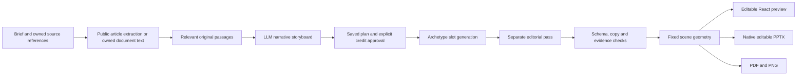

# Presentation design engine and writer capability review

Date: 5 October 2026. This document separates implemented behavior, verification evidence and further product work. The student baseline remains [the original audit](STUDENT-PRESENTATION-UPGRADE-AUDIT-2026-10-05.md); acceptance details remain in [the implementation tracker](IMPLEMENTATION-2026-10-05.md).

## Presentation product implemented in this release

The studio now has a dedicated workspace with Create, Templates, My presentations, saved Plan review and Editor pages. A user supplies a brief, language, audience, length and sources, reviews the saved narrative and look, explicitly approves five credits, then edits the generated slides. Nine original themes provide six reusable layouts. Theme selection changes palette; the narrative selects the visual archetype.

Gamma documents a conversational creation flow with planning, research and subsequent editing. Its theme and card documentation describes a consistent styling system. These public workflows informed the new navigation and plan review; their private generation architecture is not public evidence. NotebookLM documents source-based slide generation and presentation controls. Sources: [Gamma Agent](https://help.gamma.app/en/articles/15002203-how-do-i-create-with-agent-in-gamma), [Gamma themes](https://help.gamma.app/en/articles/11029150-how-do-i-customize-themes-colors-and-fonts-in-gamma), [Gamma cards](https://help.gamma.app/en/articles/11016396-what-are-slides-in-gamma-and-how-do-they-work), [NotebookLM slide decks](https://support.google.com/gemininotebook/answer/16757456?hl=en-CA).

### Backend behavior and boundaries

- `archetypes.ts` defines discriminated TypeScript types and runtime validators. `schemas.ts` defines actual JSON Schemas with exact slot shapes, permitted source IDs and no extra properties. Supported Groq GPT-OSS models receive native strict schema decoding. Other provider paths use JSON mode where supported, explicit schema instructions and the same runtime checks. One bounded editorial repair is allowed. Native constrained output support is based on [Groq's documentation](https://console.groq.com/docs/structured-outputs); valid JSON alone does not establish correct evidence.
- Generation has separate narrative, slot-filling and editorial calls. Source context is bounded and retrieved by relevance from original passages, rather than sending every imported character on every slide call. Raw owned source text stays available for verification. This is extractive retrieval, not an invented research summary or a claim to process unlimited books.
- New plans import up to six sources with a shared 48,000-character bound. One public article is limited to 24,000 readable characters. Link import accepts public HTTPS HTML/plain text, checks robots policy before every article redirect, pins a validated public IP for TLS lookup and rejects private/reserved addresses, credentials, sensitive query keys, oversized downloads and unsupported content. Sign-in pages, paywalls and blocked sites are not bypassed. PDFs use the existing owned document library. It does not recursively crawl an entire domain.
- Cached public extraction is isolated per account, reused for ten minutes, and expires after a day through a Mongo TTL date or SQLite cleanup. Saved draft/deck references remain part of those artifacts.
- Titles allow at most eight words; categories use two or three words; card bodies use at most twenty words. Metric plans must include three distinct cited numerical values in their slide purpose before generation can be charged. Metrics require an exact original supporting excerpt containing their value; qualitative labels are rejected as metrics. Quotes require original text and a supplied author/publisher; unsupported credentials must be empty. These checks reject structural fabrication. They do not independently prove that a source is true, that a number measures the claimed phenomenon or that an extracted sentence is the correct editorial choice.
- Geometry belongs to `scene.ts`, not the model: 1280 × 720, 64px outer content margin, consistent card padding, typography and accent allocation. Preview, native export and visual export share these scene tokens. Manual object edits retain structural artwork until a user explicitly switches layout.
- A worker saves each completed slide under a renewable lease. Temporary provider failures schedule bounded retries without a second charge; exhausted retries preserve partial slides and refund once. Provider capacity, credits and source access remain real server checks. A retry is not an uptime guarantee.
- Shared/audience payloads exclude speaker notes, metric support excerpts and private source material. Ownership and stale revision checks apply to plans, deck edits and exports. Historical twelve-layout decks remain supported.

### Template sourcing

The nine palette themes and six layout geometries are original repo code, giving 54 palette/layout combinations, not 54 independently designed templates. No proprietary Gamma assets were copied. Lucide icons are generated from the installed package, with its ISC and derived Feather MIT notices retained in `licenses/lucide-LICENSE.txt`. See [Lucide licensing](https://lucide.dev/license). More template variety should come from original compositions, licensed asset packs or user-owned imports; each external asset needs an explicit license and attribution record.

### Presentation acceptance still to expand

1. Durable, cancellable asynchronous planning with a conversational clarification history; current storyboard preparation is a bounded request and can report provider unavailability.
2. Original photographic/illustrated layouts and licensed image retrieval with alt text and source attribution.
3. Semantic diagram and dense chart archetypes with table-backed, editable data and units.
4. Per-claim evidence anchors, source-page verification and unsupported-claim labels.
5. Token-aware, multi-document map/reduce with saved extraction stages for larger documents.
6. More typography and RTL fixtures, font embedding strategy and direct PowerPoint comparison.
7. Drag/resize handles, grouping, object snapping and keyboard object controls.
8. Plan autosave, conflict recovery, job cancellation and export history.
9. Collaborative simultaneous editing and publication-grade accessible deck controls.
10. Better text-fit review for extreme accepted strings and custom recipient fonts. Passing the tested fixtures does not certify every possible input.

## Medium comparison and 40 writer recommendations

Medium distinguishes followers from email subscribers, and its publication system includes contributor roles, customizable pages and newsletters. Its detailed stats distinguish visits from sustained reads and provide wider audience/distribution reporting. Canonical links are supported for cross-posting. Sources: [publication roles and pages](https://help.medium.com/hc/en-us/articles/115004681607-Getting-started-with-a-Medium-publication), [newsletters](https://help.medium.com/hc/en-us/articles/115004682167-Newsletter), [detailed stats](https://help.medium.com/hc/en-us/articles/34831991136151-Story-s-detailed-stats-page), [canonical links](https://help.medium.com/hc/en-us/articles/360033930293-Set-a-canonical-link).

The following are Syaahi recommendations. Rows marked planned are acceptance work, not working buttons or shipped capabilities. Existing platform features do not establish feature parity with Medium.

| #   | Capability and value                                            | Current evidence / next acceptance requirement                                                                                                                       |
| --- | --------------------------------------------------------------- | -------------------------------------------------------------------------------------------------------------------------------------------------------------------- |
| 1   | Explicit writer enrollment protects role boundaries.            | Existing: verified enrollment uses the same identity/wallet; opening a writer URL does not grant writer access.                                                      |
| 2   | Independent writer home avoids student redirects.               | Existing: writer home, membership, settings and support routes; auth/browser regressions verify role separation.                                                     |
| 3   | Public profile creates a writer identity.                       | Existing: writer photo, bio, pronouns, About and current published bylines.                                                                                          |
| 4   | Responsive focused editor supports long-form writing.           | Existing: rich editor, ribbon, keyboard formatting, insertion, previews and mobile layouts.                                                                          |
| 5   | Private autosaved drafts reduce lost work.                      | Existing: account drafts, revision checks and private revisions before editorial submission.                                                                         |
| 6   | Revision history supports safe correction.                      | Existing: stored revisions; extend to richer side-by-side comparison and conflict recovery.                                                                          |
| 7   | Canonical URLs help legitimate cross-posting.                   | New: validated original HTTPS URL saves with a story and becomes its published canonical metadata.                                                                   |
| 8   | Following makes an audience relationship durable.               | New: authenticated follow/unfollow with replay-safe state and real aggregate counts.                                                                                 |
| 9   | A reading library makes readers return.                         | New: account reading positions, followed writers and private highlights, with student/writer entry pages.                                                            |
| 10  | Source-checked highlights prevent detached invented quotations. | New: selected story passages must match the original published body.                                                                                                 |
| 11  | Private notes support thoughtful reading.                       | New: notes are owner-scoped and excluded from public responses and profile APIs.                                                                                     |
| 12  | Public responses create discussion.                             | New: authenticated, plain-text responses with stable retry IDs and visible public-name disclosure.                                                                   |
| 13  | Author moderation keeps discussion manageable.                  | New: authors and response owners can remove a response; other accounts cannot.                                                                                       |
| 14  | Qualified reader counts improve on raw page opens.              | New: server-bounded signed-in elapsed time; readers reaching 30 seconds are counted separately.                                                                      |
| 15  | Honest analytics avoid inflated success metrics.                | Existing page opens remain approximate; new reader counts are explicitly signed-in estimates, not proof of attention or earnings.                                    |
| 16  | Saved bookmarks provide a lightweight library.                  | Existing bookmarks; add folder/list organization in the next reading-library iteration.                                                                              |
| 17  | Named private/public reading lists support curation.            | Planned: owner-scoped list CRUD, list membership, explicit public visibility and revocable sharing.                                                                  |
| 18  | A followed-writers feed rewards following.                      | Planned: indexed feed pagination using real follow state and published visibility checks.                                                                            |
| 19  | Topic following improves discovery.                             | Planned: explicit interest preferences, topic pages and removable subscriptions.                                                                                     |
| 20  | Transparent feed ranking builds trust.                          | Planned: explain freshness/topic/follow reasons, downrank abuse and allow preference resets.                                                                         |
| 21  | Mute and block controls improve reader safety.                  | Planned: server-side exclusions, response protection and immediate cache invalidation.                                                                               |
| 22  | Reply threads support deeper conversation.                      | Planned: bounded nesting, parent visibility checks, moderation and reply notifications.                                                                              |
| 23  | Notification preferences avoid unwanted messages.               | Planned: separate followed-author, response and editorial events, with read state and per-channel opt-ins.                                                           |
| 24  | Email subscriptions create a distinct reader relationship.      | Planned: explicit double opt-in, unsubscribe tokens and preferences; following must not silently opt in.                                                             |
| 25  | Newsletter creation can bring readers back.                     | Planned: separate newsletter landing pages and drafts; configured delivery queue and explicit approval before sending.                                               |
| 26  | Newsletter reliability protects reputation.                     | Planned: provider idempotency, bounce handling, suppression lists and verified sender setup.                                                                         |
| 27  | Shared publication workspaces support teams.                    | Planned: publication records, owner/editor/writer roles and expiring invitations.                                                                                    |
| 28  | Publication homepages support editorial identity.               | Planned: owned logos, featured sections, accessible layouts and publication-specific routing.                                                                        |
| 29  | Publication review separates contributor authority.             | Existing central editorial review; publication-specific submission/approval permissions remain planned.                                                              |
| 30  | Scheduled publication supports predictable releases.            | Planned: timezone-aware durable schedules, worker claims, cancellation and one-time publication.                                                                     |
| 31  | Public article imports simplify migration.                      | Planned: source rights confirmation, secure extractor reuse, preserved attribution/canonical links and preview before saving.                                        |
| 32  | Detailed monthly analytics guide better writing.                | Planned: bucketed views/reads/engagement with privacy-safe aggregates and low-sample labels.                                                                         |
| 33  | Traffic-source reporting shows useful distribution.             | Planned: bounded referrer/UTM attribution without storing private full URLs or identifying readers.                                                                  |
| 34  | Follow conversion shows audience growth.                        | Planned: story-attributed follow events, unfollow adjustments and aggregate privacy rules.                                                                           |
| 35  | Newsletter reporting improves editorial choices.                | Planned: delivery and click aggregates with explicit tracking preferences and retention limits.                                                                      |
| 36  | Member-only articles require real entitlement checks.           | Planned: server-side visibility and excerpt policies; current paid credits do not paywall stories.                                                                   |
| 37  | Friend-access links permit controlled sharing.                  | Planned: hashed tokens, expiries, revocation and entitlement exceptions scoped to one story.                                                                         |
| 38  | Writer earnings require a separate financial system.            | Planned: eligibility, verified payout accounts, fraud review, settlement ledger and merchant payout configuration. The current credit checkout does not pay writers. |
| 39  | Custom domains require verified ownership.                      | Planned: DNS verification, TLS provisioning, canonical routing and safe domain removal.                                                                              |
| 40  | Export, deletion and abuse operations support trust.            | Existing reporting/security boundaries; extend complete reading-data export/delete, publication moderation and documented retention. No attack-proof claim.          |

Suggested order: finish reader discovery and curation (17–23), then consented newsletters (24–26), then publication/team workflow (27–30). Commerce, payouts and custom domains need their own acceptance and operational configuration. They should not be represented by placeholder controls.

## Verification evidence

- `test:presentation-engine`: six schemas and native request format, separate generation/editorial passes, bounded repair, original-passage retrieval, ownership/revisions, single-charge generation, delayed provider retry/refund and private audience projection. Both SQLite and Mongo fixtures are supported.
- The same suite generates native PPTX and measures browser text fitting for six layouts in three themes, plus long English/Hindi bento/comparison/four-step fixtures. Actual PPTX files were imported and rendered with Artifact Tool; selected native renders were visually inspected. Direct PowerPoint comparison remains outstanding.
- `test:presentation-workspace-browser`: real source import/removal, recovered brief, nine themes/filter, owned saved plan discovery, reorder/save/reload, cost approval and saved semantic edits. Plan/editor checks cover 320/390/768/1440px. Following, public responses, private highlights, library and canonical metadata are tested through real local APIs.
- `test:writer-social`: SQLite and Mongo ownership, replay, moderation, private source-checked highlights, elapsed-time bounds, canonical persistence and removed-story denial.
- A fresh configured-model fixture extracted the public Syaahi About page, prepared a validated storyboard, completed six slides through saved quota retries and produced PPTX/PDF/PNG. This used a local fixture wallet. It was not a hosted customer-account generation or a payment test. Provider quota/service errors occurred during the run; successful completion does not establish unlimited capacity. The earlier invalid qualitative-as-metric plan prompted the new pre-charge numerical eligibility check.
- Existing student studio, twelve-layout export, writer/auth/mobile, security, billing-catalogue and SEO regressions are retained. Current commit and live frontend/backend verification are recorded in the implementation tracker after push.

The new design engine is a substantial implemented upgrade. Conversational clarification, arbitrary asset generation, complete Medium publication/commerce features and the broader outstanding student audit are not all finished by this release.
