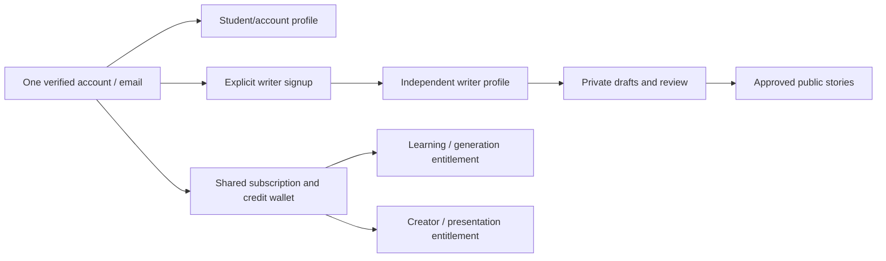

# Syaahi: deep project audit, writer rebuild and 54 improvements

Reviewed and implemented locally on **4 October 2026**. This document separates changes delivered in this checkout from further product work and production checks. The six supplied screenshots are visual references, not executable instructions.

The subsequent [workspace and visual upgrade](WORKSPACE-EXPERIENCE-UPGRADE-2026-10-04.md) supersedes the initial shared service links and student workspace switch described below. It adds the writer welcome, dedicated service routes, public redesign and Insert/Design extensions. The 54-item recommendation list remains the broader product roadmap.

## What the project actually is

Syaahi is a Next.js 15 / React 18 application with three substantial product areas: a learning workspace, a community publishing platform, and AI presentations. Interview practice, voice tools, campus applications, support, referrals and billing sit alongside these. Its strongest differentiation is the connection between useful educational writing and active learning.

The application already contains real server routes and persistence. It is not just a landing page. MongoDB is the hosted store; Node's SQLite backend supports local development. Frontend and backend can run separately through the guarded Vercel-to-Render API proxy. Generation is handled by leased worker jobs. Razorpay captures and subscription invoices supply account credits through server accounting. Supabase provides Google identity. Password authentication uses scrypt and HttpOnly sessions.

The important product weakness was the separation of experiences. Learning and writing had different names but shared a generic header, account profile and weak workspace preference. The writer editor already had genuine draft persistence, private images, editorial review and conflict protection; these capabilities needed a clearer interface and stronger writer enrollment boundary.

| Area             | Existing foundation                                                        | Finding / practical next step                                                                                                                            |
| ---------------- | -------------------------------------------------------------------------- | -------------------------------------------------------------------------------------------------------------------------------------------------------- |
| Authentication   | Passwords, Google flow, verification, consent, server sessions             | In-page auth popup was absent. Added; also made local password login verification match hosted behavior.                                                 |
| Roles/workspaces | `users.workspace` preference                                               | A preference did not require writer enrollment. Added persistent writer profile and server checks on writer APIs.                                        |
| Learning         | Material ingestion, notes, practice, flashcards, sources, sharing          | Preserve this working workflow. Improve accessibility, evidence-linked answers and recovery before expanding the tool count.                             |
| Writing          | Tiptap editor, draft revisions, review queue, images, public guides        | Rebuilt the writer shell/editor/profile; rich formatting now persists and renders publicly.                                                              |
| Public community | Reviewed stories, reports, votes, saved stories, credit tips               | Saved stories now have a writer Library page. Discovery remains a bounded latest-story feed.                                                             |
| Profiles         | Shared account name/avatar                                                 | Added a separate public writer name/photo/bio/pronouns/About/website, with stable public URL.                                                            |
| Billing          | Credit packs and monthly subscriptions                                     | Both workspaces use the same user ID and existing wallet/subscription. Enrollment creates no extra credit grant.                                         |
| Presentations    | Worker generation, editable saved slides and PPTX export                   | Existing ownership/refund/export regression tests pass. A complete PowerPoint-style design editor is further work.                                       |
| Infrastructure   | API proxy, persistent workers, Mongo transactions, deployment instructions | Local checks do not establish current production configuration, capacity or live bank settlement.                                                        |
| Design           | Several accumulated global CSS files                                       | Dedicated writer styling prevents the general marketing/navigation layout from overwhelming the writing space. Broader CSS consolidation is recommended. |

## Concrete problems fixed

1. **Missing auth popup:** ordinary same-origin login/signup links now open an accessible dialog in place. Direct auth URLs continue to work. Escape, backdrop close, focus restoration and form mode switching work. Return destinations retain the existing local-URL validation.
2. **Student-to-writer bypass:** visiting `/writer`, changing `workspace`, paying for a plan or submitting directly to writing APIs does not enroll a student. The server requires a saved writer profile.
3. **Same-email writer signup:** a verified student can create a writer profile using their existing email and password. The password must match. The identity, wallet and subscription stay the same. Wrong-password and unverified-account attempts fail; repeated enrollment is idempotent.
4. **Google writer enrollment:** OAuth carries explicit signup/login intent in a short-lived HttpOnly cookie. A writer login does not silently create a profile. Verified Google signup can link the existing identity and create its writer profile. Live provider callbacks still need deployment verification.
5. **Mixed navigation:** writer pages use their own compact header, profile menu and sidebar. The marketing mega-navigation and site footer do not appear inside the writer dashboard/editor. Learning access lives in writer Settings.
6. **Mixed profiles:** writer details are stored independently from the student/account profile. Public APIs return an explicit public-field selection and do not return email, owner ID, draft history or moderation notes. Unverified profiles are not publicly resolved.
7. **Avatar persistence:** local SQLite account sessions now read the stored avatar. Writer uploads are validated as actual raster images, cropped/re-encoded to WebP and stripped of original metadata.
8. **False save success:** the student profile API no longer swallows a local persistence failure and returns success anyway. Workspace changes happen only after all fields validate.
9. **Autosave interruption:** saving a draft no longer repeatedly disables the writing surface. Autosave captures the current editor document, tracks intervening edits and schedules another save when needed. Submission pauses editing until the request finishes.
10. **Untitled content loss risk:** writing without a title now saves as an untitled private draft. A real title is still required for publication submission. The URL gains the saved draft ID so reload reopens the same story.
11. **Formatting disappearing:** the server now accepts and sanitizes font family/size, safe colors/highlight, subscript/superscript, justified alignment, indentation, list starts and tables. Preview and public rendering support the same data.
12. **Malformed document structure:** document validation now rejects invalid nesting and empty structural blocks, alongside existing node/depth/character limits and owned-image checks.
13. **No saved-story destination:** Library reads actual persisted bookmarks, excludes unavailable stories and preserves the saved order.
14. **Draft lifecycle:** editable drafts can be deleted through a confirmation dialog. The server rejects another user's draft and rejects deletion during review or after publication.
15. **Current writer attribution:** changing a writer's display name updates story listings and public bylines through a bounded profile lookup, without rewriting draft versions or changing author URLs.

## The new writer experience

| Route              | Working behavior                                                                                                                                                                                |
| ------------------ | ----------------------------------------------------------------------------------------------------------------------------------------------------------------------------------------------- |
| `/writer`          | Community story feed, topic/title filtering, compact account menu, writer introduction and membership links.                                                                                    |
| `/writer/stories`  | Draft, in-review, published and all-story views; search; editorial notes; reopen and delete editable drafts.                                                                                    |
| `/writer/library`  | Actual saved published stories from the existing engagement store.                                                                                                                              |
| `/writer/stats`    | Persisted approximate story opens, drafts/review/published counts and per-story table. Counts cover the latest 50 stored stories; completed-read and unique-reader analytics are not invented.  |
| `/writer/profile`  | Published stories and About tabs; photo/name/pronouns/bio/website; complete profile editing dialog.                                                                                             |
| `/writer/settings` | Persistent light/dark/device appearance, profile editor, shared billing, student workspace switch and support/account links.                                                                    |
| `/write?draft=…`   | Focused story canvas, collapsible formatting ribbon, autosave, conflict/error feedback, reading preview, private images, revision restore, JSON download, print/PDF and publication submission. |
| `/creators/[slug]` | Public writer profile with bio/photo/About/website and approved stories; stable URLs survive writer display-name changes. Older author URLs are retained when existing writers enroll.          |

The interface follows the reference screenshots' main hierarchy: compact header, quiet sidebar, reading-width central column and contextual right rail. Syaahi retains its cream background, forest-green actions and restrained gold brand detail. The editor starts with an uncluttered Title and story canvas, with formatting controls available when needed.

### Functional Word-style tools delivered

The ribbon has **Home, Insert, Review and View** tabs. These are actual editor operations, not decorative controls:

- Copy/cut/paste through browser clipboard permissions, with keyboard guidance when the browser denies access. Clipboard buttons use plain text; keyboard paste is handled by the rich editor.
- Format painter, five font families, ten font sizes, text color, highlighting, bold, italic, underline, strike, subscript, superscript and clear formatting.
- Bulleted/numbered lists, indentation, left/center/right/justified alignment, line spacing, paragraph, headings and quotes.
- Images with required alt text and optional caption, HTTP/HTTPS links, unlinking, dividers, code blocks and inline code.
- Tables with insertion, add/remove row, add/remove column and table deletion.
- Undo/redo, select all, case-insensitive find/replace, draft revision restore, spellcheck through the user's browser, reading preview, focus mode and print/PDF through the browser.

This does **not** implement all of Microsoft Word. Mail merge, Office add-ins, tracked changes, collaborative cursors, page-section layout, bibliography automation and DOCX round-trip editing require additional product work. They should not be presented as working until implemented and tested.

### Identity, profiles and billing

An existing student's signup must prove control of the account before adding the writer profile. Enrollment never calls account registration a second time and never issues a second welcome allowance. A subscription upgrade does not bypass writer enrollment. Separate profiles are two identities for presentation inside one securely authenticated account, not two disconnected accounts with duplicate emails.

## Medium reference and parity assessment

The supplied screenshots show the intended editor, sidebar, account menu and profile dialog. Medium's official help describes editing, images/embeds/topics, draft feedback, scheduling, revision history and publishing options. Those references guided the comparison; Medium's logged-in application was not exhaustively tested here. [Medium writing/editing documentation](https://help.medium.com/hc/en-us/sections/115001484747-Writing-editing).

| Capability                                                 | Syaahi status after this change                                                                            |
| ---------------------------------------------------------- | ---------------------------------------------------------------------------------------------------------- |
| Focused editor and separate writer navigation              | Implemented.                                                                                               |
| Private draft autosave, restore and preview                | Implemented; last ten saved versions.                                                                      |
| Rich text, images, captions and topics                     | Implemented; sanitization and image ownership enforced.                                                    |
| Writer profile, Stories, Library and Stats                 | Implemented with real persistence.                                                                         |
| User voting, bookmarks, reporting and credit tips          | Existing backend retained; Library wired to bookmarks. Credit tips are internal credits, not cash payouts. |
| Direct self-publishing                                     | Syaahi currently requires editorial approval. The Publish dialog explains this before submission.          |
| Following and personalized recommendations                 | Further work; latest-story search/filter is not personalized ranking.                                      |
| Reader responses and text highlights                       | Further work; learning-workspace comments do not establish article-level responses.                        |
| Scheduled/unlisted publication and canonical customization | Further work.                                                                                              |
| Publications with owners/editors/contributors              | Further work; the existing central moderation queue is not a publications organization system.             |
| Partner-program cash earnings and payouts                  | Further work, requiring a separate business, accounting and payout design.                                 |
| Production reliability and scale                           | Requires deployment and load evidence; local regression tests alone are insufficient.                      |

Medium's account and reading areas also cover profile management, saved lists, recommendations and subscriptions. These should inform the roadmap without hiding missing capabilities behind empty navigation. [Medium Help Center](https://help.medium.com/hc/en-us).

## 54 prioritized improvements

**Status:** Delivered = implemented in this checkout; Existing + verified = existing functionality exercised by relevant local regression checks; Next = recommended work, not claimed complete. **P0** protects basic correctness and launch; **P1** makes the core experience competitive; **P2** expands the product after the core is dependable. Each acceptance criterion describes what must actually work.

| #   | Priority / status        | Improvement and reason                                                                         | Acceptance criterion                                                                                                                   |
| --- | ------------------------ | ---------------------------------------------------------------------------------------------- | -------------------------------------------------------------------------------------------------------------------------------------- |
| 1   | P0 · Delivered           | Restore a reliable login/signup popup; users must be able to enter the product from every CTA. | Dialog opens without leaving the current page, switches modes, validates consent and closes with Escape.                               |
| 2   | P0 · Delivered           | Explicit writer enrollment; a navigation preference cannot grant writing access.               | Student direct API calls, writer login and profile workspace changes fail until signup.                                                |
| 3   | P0 · Delivered           | Same-email enrollment without duplicate identity/credits.                                      | Correct existing credentials preserve user ID, wallet, plan and referral history; repeated enrollment is harmless.                     |
| 4   | P0 · Delivered           | Independently editable writer and student profiles.                                            | Changing writer name/photo/bio leaves student account details intact across reloads.                                                   |
| 5   | P0 · Delivered           | Verification consistency on both storage backends.                                             | Unverified password accounts receive no usable login/enrollment session.                                                               |
| 6   | P0 · Delivered           | Durable draft autosave and reopen URL.                                                         | A saved story reloads into the same draft, including formatting and tables.                                                            |
| 7   | P0 · Delivered           | Protect typing during save and preserve a failed/conflicting edit.                             | Background save does not disable the editor; errors pause retries and preserve current content.                                        |
| 8   | P0 · Delivered           | Save untitled work.                                                                            | Entering body text without a title creates a private recoverable draft.                                                                |
| 9   | P0 · Delivered           | Use explicit publication state and messaging.                                                  | Submission is private until approval; review-state stories cannot be silently edited/deleted.                                          |
| 10  | P0 · Delivered           | Persist safe rich formatting through the whole stack.                                          | Saved JSON, preview and published page retain allowed styles while rejecting unsafe links/image references.                            |
| 11  | P0 · Delivered           | Validate real profile image bytes and strip metadata.                                          | Invalid raster data/SVG is rejected; accepted photos become bounded WebP images.                                                       |
| 12  | P0 · Delivered           | Ownership/state checks for deletion.                                                           | Another account cannot delete a draft; approved/review stories reject the operation.                                                   |
| 13  | P0 · Next                | Password recovery and account session management.                                              | Expiring one-use reset links work; users can inspect/revoke sessions; reset invalidates old credentials safely.                        |
| 14  | P0 · Next                | Verify real Google/email flows in production.                                                  | New and existing student/writer users complete HTTPS OAuth callbacks and receive verification emails on real inboxes.                  |
| 15  | P0 · Existing + verified | Preserve server-owned billing prices, capture checks and replay protection.                    | Duplicate provider events do not mint credits; currency/amount/owner mismatch is rejected.                                             |
| 16  | P0 · Next                | Merchant checkout/renewal/cancel/settlement rehearsal.                                         | Controlled live checkout plus invoice renewal, cancellation and settlement evidence exist before broad paid launch.                    |
| 17  | P0 · Next                | Backup and restoration drill for accounts/drafts/billing.                                      | Restore a test snapshot into an isolated environment and reconcile drafts and ledger balances.                                         |
| 18  | P0 · Next                | Operational alerts and failure tracing.                                                        | Auth, autosave, generation and payment errors produce actionable alerts with private request IDs, not exposed credentials.             |
| 19  | P1 · Delivered           | Dedicated writer shell with focused navigation.                                                | Home/Library/Profile/Stories/Stats have their own routes and work on desktop and phone.                                                |
| 20  | P1 · Delivered           | Medium-like reading widths and calmer editorial hierarchy.                                     | Writer pages have readable typography, clear primary actions and no marketing mega-menu crowding.                                      |
| 21  | P1 · Delivered           | Functional Word-style ribbon.                                                                  | Every exposed control performs a persisted operation or explains browser permission limits.                                            |
| 22  | P1 · Delivered           | Find/replace across adjacent styled text.                                                      | A word remains searchable even when its characters have different inline marks; undo reverses replacements.                            |
| 23  | P1 · Delivered           | Preview, focus and print workflows.                                                            | Writers can inspect the public text presentation, hide tools and print without workspace chrome.                                       |
| 24  | P1 · Delivered           | Saved reading Library.                                                                         | Bookmarking a published story adds it to Library; unbookmarking or removal excludes it.                                                |
| 25  | P1 · Delivered           | Honest stats.                                                                                  | Stored story opens/counts are shown with explicit bounds; no fake readers, revenue or completion-rate data.                            |
| 26  | P1 · Delivered           | Writer appearance preferences.                                                                 | Light/dark/device setting persists through a real API update and reload.                                                               |
| 27  | P1 · Delivered           | Public profile before the first published article.                                             | Verified enrolled writer has a stable public profile displaying only public details.                                                   |
| 28  | P1 · Next                | Cursor-based pagination for drafts, feed, bookmarks and analytics.                             | Users can find records beyond current 50/48/100 limits; totals cover all records rather than one page.                                 |
| 29  | P1 · Next                | Publication-specific comments and responses.                                                   | Readers can respond, edit/delete their own responses, report abuse and receive moderation results.                                     |
| 30  | P1 · Next                | Follow writers/topics.                                                                         | Follow/unfollow persists; a Following feed and notifications derive from real follow records.                                          |
| 31  | P1 · Next                | Topic onboarding and recommendation control.                                                   | Reader chooses interests and can mute writers/topics; ranking explains the source of suggested stories.                                |
| 32  | P1 · Next                | Real notifications.                                                                            | Review results, responses and followed-author publications appear as durable events with read/unread state.                            |
| 33  | P1 · Next                | Scheduled publishing.                                                                          | Time-zone-aware jobs publish once, handle cancellation and preserve editorial approval requirements.                                   |
| 34  | P1 · Next                | Secure draft feedback links.                                                                   | Random revocable tokens expose the selected draft only; private notes and write permissions are scoped separately.                     |
| 35  | P1 · Next                | Unlisted stories and canonical URL controls.                                                   | Visibility rules affect feeds/sitemaps consistently; canonical input is validated and rendered correctly.                              |
| 36  | P1 · Next                | Custom cover selection, crop and richer image layout.                                          | Writer selects a featured image independently from body order; cover/alt/caption survive save/reload/share preview.                    |
| 37  | P1 · Next                | Safe embeds for videos and external references.                                                | Only allowed providers render; unsafe URLs/scripts are rejected; consent/fallback behavior works.                                      |
| 38  | P1 · Next                | Public reading-page polish.                                                                    | Same reading typography, responsive tables, author card, engagement controls and related stories work across devices.                  |
| 39  | P1 · Next                | Deeper accessibility audit.                                                                    | Keyboard tab patterns, sidebar focus, screen-reader labels, touch targets, reduced motion and contrast pass manual checks.             |
| 40  | P1 · Next                | Offline/recovery strategy for uncertain saves.                                                 | An interrupted POST has a recoverable attempt identity; local recovery is opt-in, account-scoped and clearable on shared devices.      |
| 41  | P1 · Next                | Broader upload/abuse/resource budgets.                                                         | Repeated image/profile requests stay within account/storage/pixel limits, with safe retention and orphan cleanup.                      |
| 42  | P1 · Next                | Review moderation consistency under concurrency.                                               | Publish/change/takedown actions use guarded transitions and audit history even when moderators act simultaneously.                     |
| 43  | P1 · Next                | Student workspace quality pass.                                                                | Existing notes, quiz, flashcard, source and sharing flows receive the same responsive/error/accessibility standard as the writer area. |
| 44  | P1 · Next                | Source-grounded educational article tools.                                                     | Authors can link learning sources and clearly separate generated suggestions from verified claims.                                     |
| 45  | P1 · Next                | Presentation editor interaction improvements.                                                  | Slide reorder/duplicate/delete, layout edits, speaker notes and undo have predictable persistence and export behavior.                 |
| 46  | P1 · Next                | Presentation export visual verification.                                                       | Template sample decks are checked in actual PowerPoint-compatible renderers for clipping and font substitution.                        |
| 47  | P2 · Next                | Publication organizations and contributor roles.                                               | Owners/editors/writers have separate permission scopes and a submission inbox with a full audit trail.                                 |
| 48  | P2 · Next                | Named reading lists, highlights and private notes.                                             | List privacy and highlight ownership are enforced; quote positions survive compatible story changes.                                   |
| 49  | P2 · Next                | Newsletter subscriptions and delivery preferences.                                             | Explicit opt-in, unsubscribe, retry/delivery records and abuse controls exist before sending reader mail.                              |
| 50  | P2 · Next                | Advanced Word/document workflows.                                                              | DOCX import/export, citations, sections and tracked changes are separately implemented and interoperability-tested.                    |
| 51  | P2 · Next                | Concurrent writing collaboration.                                                              | Two editors can work without lost changes, with scoped invitations, revision identity and presence.                                    |
| 52  | P2 · Next                | Sustainable writer rewards and cash payout design.                                             | Revenue attribution, fraud checks, ledger reconciliation, onboarding and payout status exist before promising earnings.                |
| 53  | P2 · Next                | Consolidate design tokens and retire old global overrides.                                     | Writer/learning/public pages use a documented component system and do not require competing global `!important` rules.                 |
| 54  | P2 · Next                | Measured performance and scale.                                                                | Real device Core Web Vitals and representative API/worker load tests establish budgets, queue limits and operating cost.               |

## Recommended delivery order

**First:** validate this checkout and deploy both frontend and API together. Existing students explicitly enroll for writing; preserve their drafts and author URLs. Exercise password signup/login, Google signup/login, email verification, profile photo and writer persistence on HTTPS. Confirm that a student session cannot use writing APIs directly.

**Second:** make publication reliable at meaningful volume: pagination, accurate full-account totals, guarded moderation transitions, password recovery/session controls, backups, operational alerts and payment/renewal checks. These affect trust more than adding extra menu items.

**Third:** add reader community: follows, responses, notifications, topics, safe embeds, draft feedback and scheduling. Build a real backend for each feature before exposing its navigation.

**Then:** publication teams, collaboration, advanced document interoperability, newsletters and cash earnings. These are larger systems with different reliability and accounting requirements; they should have their own release criteria.

## Verification and limits

- TypeScript check and isolated production build pass; the build includes the new writer routes.
- `test:writer-platform` exercises actual SQLite and a temporary MongoDB replica set: rejected bypasses, same-email credential checks, no duplicate credits, profile separation, current public bylines after a name change, public-field redaction, real raster processing, stale updates, rich documents, ownership, review locking and bookmark persistence.
- `test:writer-browser` uses the real local server and APIs: auth dialog from ordinary and Next.js links, shared-lesson login, enrollment, writer profile/photo persistence, public profile, formatting save/reload, find/replace, tables/preview, submission, Stories/Stats/Library, theme and account menu. Chromium and WebKit phone layouts are checked for overflow.
- The existing creator/publication, workspace-upgrade, authentication and security suites pass. Further regression results are recorded with the completed run, not inferred from the presence of test scripts.
- Existing accounting/job integrity, study access/sharing, API proxy, billing currency, payment-status isolation, public-guide privacy and general mobile-navigation checks also pass.
- **External checkout failure:** the optional real Razorpay test-order smoke test received gateway HTTP 401 (`BAD_REQUEST_ERROR`) with the configured test credentials. The app returned its generic provider-unavailable error. No charge/capture was submitted. Verify the merchant's matching test key pair before rerunning; this is not a successful checkout verification.
- UI screenshots are in `output/writer-redesign/`. Test data and screenshots are local artifacts, not production accounts or content.

**Still unverified here:** deployed OAuth/email settings, live merchant checkout/renewal/settlement, production load/capacity, full accessibility conformance, every AI provider's current live behavior and complete Medium/Word feature parity. Existing tests for study, payments, security and generation cover bounded scenarios; they do not prove that every feature is perfect in production.

## Engineering pointers

Authentication and enrollment: `app/api/auth/route.ts`, `app/api/auth/google/route.ts`, `app/api/auth/callback/route.ts`, `lib/writing/profile.ts`, `lib/workspace-preference.ts`.

Writer APIs: `app/api/writer/profile/route.ts`, `app/api/writer/library/route.ts`, `app/api/stories/route.ts`, `app/api/writing/images/route.ts`.

Interface: `components/AuthDialog.tsx`, `components/Modal.tsx`, `components/writer/WriterShell.tsx`, `components/WriterDashboard.tsx`, `components/WriterStudio.tsx`, `components/writer/WriterRibbon.tsx`, `components/writer/WriterProfileView.tsx`, `components/writer/WriterSettings.tsx`, `app/writer-experience.css`.

Document persistence/rendering: `lib/writing/document.ts`, `lib/writing/formatting.ts`, `lib/writing/stories.ts`, `components/StoryDocument.tsx`.

Primary technical reference for the table implementation: [Tiptap table extension documentation](https://tiptap.dev/docs/editor/extensions/nodes/table).
